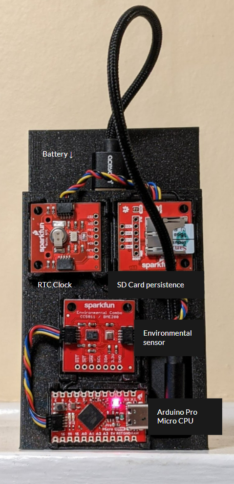
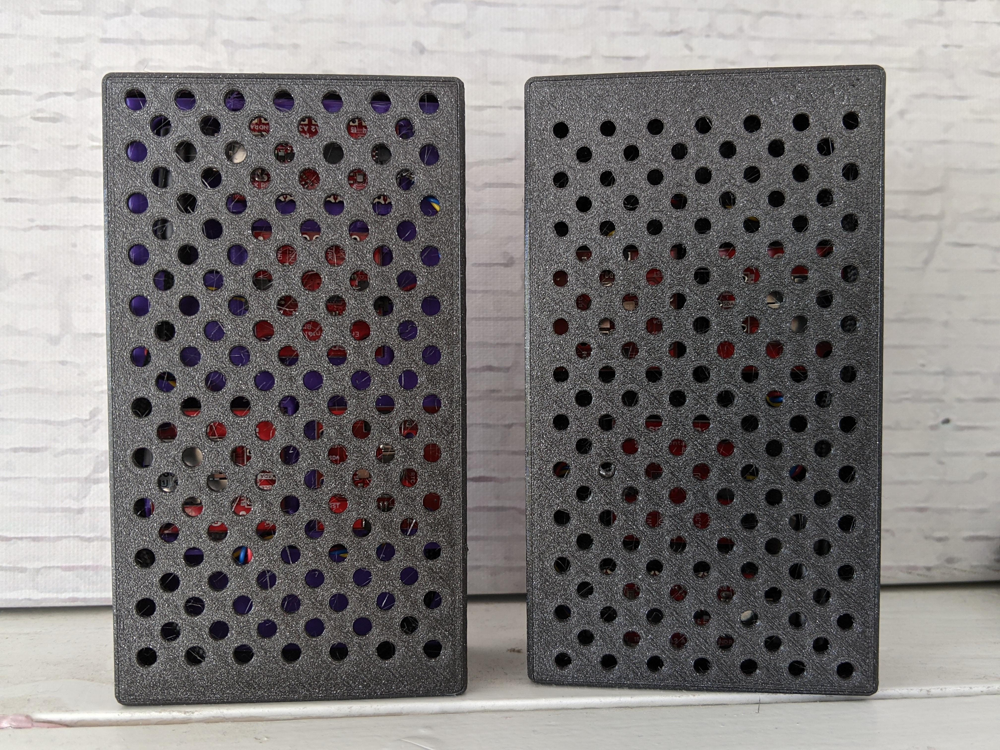

# Intro
This is the repository for code and documents for the sensor we built for our w241 - Causal Inference class project, Spring 2022.

It should give you enough information to build one of these sensors should you so desire.

# Components required

## Arduino components

- [Sparkfun Qwiic Pro Micro USB-C](https://www.sparkfun.com/products/15795?_ga=2.264082766.31748102.1649701746-416199447.1644960318)  This is the Arduino mainboard we used.  Other boards can be used instead, but the CAD expects this one and the other boards are Qwiic connectors so it should support this.
- [Sparkfun CCS811/BME280 (Qwiic) Environmental Combo Breakout](https://www.sparkfun.com/products/14348?_ga=2.264082766.31748102.1649701746-416199447.1644960318) This board is the heart of the sensor.  Once calibrated (see notes below) it will measure temperature, humidity, air pressure, CO2 and TVOC.
- [SparkFun Real Time Clock Module](https://www.sparkfun.com/products/14558?_ga=2.62422382.31748102.1649701746-416199447.1644960318)  This chip is required to have a continuous sense of time.  Without it the device's only sense is seconds since power cycle.  Nominally that would work for an experiment, but in practice the power tends to flicker and cause frequent resets.
- [Sparkfun Qwiic OpenLog](https://www.sparkfun.com/products/15164?_ga=2.264082766.31748102.1649701746-416199447.1644960318)  This is required if you want to operate your device away from computer and persist the data.  Hypohtetically you could instead use a wifi card and configure it write to the cloud, but we wanted to use it in locations remote from where it was developed so could not guarenee connectivity.

## Other components
- [Battery Pack](https://www.amazon.com/gp/product/B08T8TDS8S)  The device does not care what its power supply is.  It can be powered off a computer, or any portable USB power supply. That said the CAD provided exactly matches these batteries, and using any other will require a new case.

- [USB cables ](https://www.amazon.com/gp/product/B096VYVR17) Again any USB cables can be used.  Our battery only has Micro USB and USB A, and the CPU needs USB-C.  With the case space constraints we went with these, and again, the CAD expects it.

- [3x Qwiic cables](https://www.sparkfun.com/products/17260) These aren't special, you just need 3 Qwiic cables per sensor, get what works for you.

# CAD for case and cover

If you are using all the same parts as us, you can use the STL files in the *Case STL* directory to just print them.  Hopefully they work for you.  The spaces are intentionally designed to be a tight fit for the cards, and they are all subtily different shapes so will only work exactly in the configuration shown below.  They may be quite snug, so be firm but gentile pushing them in.

Its also possible that the fit between case and cover is either too loose or too tight.  For loose (our case) use a few pieces of thin tape to fill the gaps so they are snug.

If they really don't fit, or you want to change the configuration or battery, the [Onshape CAD Project](https://cad.onshape.com/documents/a2fdd6d62e2931dea2922d15/w/b632312d6c9ec3a2012bce3f/e/c36cc9c0a84920fe10cffbab) is public. You will likely need to make an Onshape account, and then can copy the files and edit them.

# Assembly
Blow are what they should look like open, with cards installed (yes they have to go in these spots!), and with the covers on.  They are fairly inconsipcuous with covers, but the lights inside have occasionally cought folks' attention.

# Code for device

The code for the devices is in this repository in the *timed_sensor* directory.  The *base_sensor* will give you an earlier version that didn't have a persistant clock.

Use any tutorial on using the Arduino IDE to install the code on the device.  Its fairly simple, so SparkFun's basic tutorial is fine.

Code in this repo is based on the example code provided by SparkFun for each card.  They are a good reference for understanding it for modification.

## Time setting

One important issue is setting the clock chip.  The way it is set is when you push the code to the device it will set the device's time to the time at which the IDE was started.   So if you take 10 minutes from start to upload your clock will be off by that amount.  So get your code perfect, restart the IDE, and push.  Do this cycle for each device, and know they will be off by some degree due to the time this delay.  Sorry for the hassle, it is regretable!

Additionally our devices were built in one time zone, and deployed in another, so there is a 3 hour timezone correction built into the code, which may not be needed for all applications.

# Caviats for use

There are a few execution requirements to ensure you get an accurate atospheric measurements.

## Sensor Calibration

The first caveat is the sensors need to be calibrated at rest in a stable environment before starting to collect data.  The Environment chip has both the temperature sensor and the air sensor in close proximity.  At operating temperature the environmental chip can generate significant heat (up to 15 deg).  The temperature is one of the inputs for the CO2 calibration, so this temperature increase will make the measurements in accurate.  To compensate for this the device records its temperature at power up, and after 20 minutes will take the accumulated temperature change and subtract that from all subsequent measurements for calibration. In addition the plastic of the case and the battery can hold heat that messes this up.

This means for best performance when not in use you should to hold all devices in the same place, ideally not indoors, so the residual temperature is close to outdoors.  Additionally you should plug them in 20 minutes in advance, and keep them in a stabile temperature location.  So that that calibration constant is not picking up additional effects. 

Best practice would be to keep them outside, or in a cool garage, plug them in a half hour before you will deploy them, and minimize heat accumulation en route.

## Operating limits

These are prototype devices so are not environmentally secured.  In particular they are not robust to rain, so need to be placed  someplace under shelter.  Additionally direct sunlight can increase both measured temperature and CO2.  So both devices should be deployed with the same sun exposure, ideally shaddowed.
